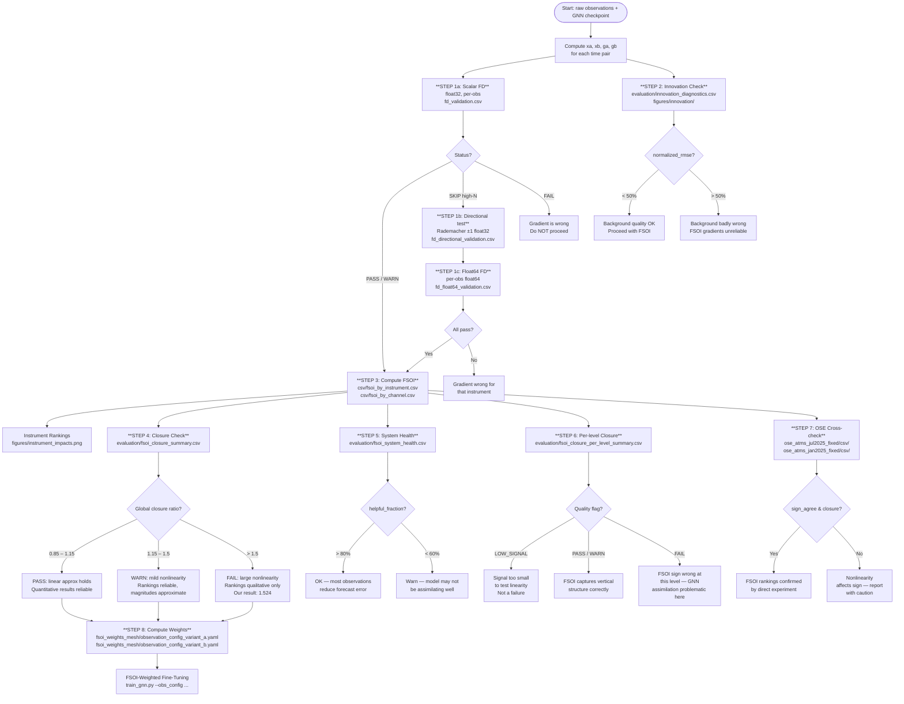

# FSOI Outputs Guide

**What is FSOI?**
FSOI (Forecast Sensitivity to Observations) answers the question: *"How much did each observation type improve — or worsen — the model's forecast?"*

For each pair of time steps, the pipeline computes:
- **xa** — the analysis: the real observation values at the current time (the truth / verified state)
- **xb** — the background: the GNN's forecast at the current time, made without seeing current observations (the prior)
- **ga, gb** — the gradients of forecast error with respect to xa and xb
- **FSOI_i = 0.5 × (xa_i − xb_i) · (ga_i + gb_i)** — the estimated impact of observation i

`xa − xb` is the **analysis increment**: how much the real observations differ from what the GNN predicted. Large increments mean the GNN was far from truth and observations carried a lot of information.

Negative FSOI = observation reduced forecast error = **beneficial**.
Positive FSOI = observation increased forecast error = **detrimental**.

---

## Validation Flowchart



---

## Output Directory Map

```
FSOI/fsoi_outputs/
├── fd_check_skip/                        ← Step 1a: scalar float32 FD (radiosonde WARN, satellites SKIP)
├── fd_check_enhanced/                    ← Steps 1b+1c: directional + float64 FD for satellites
├── full_eval_fixed_20250701_20250731/    ← Full month evaluation (Jul 2025)
│   └── radiosonde/
│       ├── csv/                          ← Raw FSOI numbers
│       ├── evaluation/                   ← All diagnostic checks
│       ├── figures/                      ← All plots
│       └── logs/                         ← Config snapshot
├── seasonal_fixed/                       ← Obs-space seasonal runs (biased)
│   ├── radiosonde_jan2025/
│   ├── radiosonde_apr2025/
│   └── radiosonde_oct2025/
├── mesh_seasonal/                        ← Primary unbiased runs
│   ├── radiosonde_250hPa_{jan,apr,jul,oct}2025/
│   ├── radiosonde_500hPa_{jan,apr,jul,oct}2025/
│   └── radiosonde_850hPa_{jan,apr,jul,oct}2025/
├── ose_atms_jul2025_fixed/               ← OSE experiment: ATMS Jul 2025
└── ose_atms_jan2025_fixed/               ← OSE experiment: ATMS Jan 2025

FSOI/fsoi_weights/                        ← Biased weights (do not use for training)
FSOI/fsoi_weights_mesh/                   ← Primary weights (use these)
```

---

## Step 1 — Gradient Validation (Three-Tier)

Gradient correctness is verified using three complementary tests that together cover all instrument types regardless of observation count.

---

### Step 1a — Scalar FD in float32

**File:** `evaluation/fd_validation.csv`
**Directory:** `fd_check_skip/`

Perturbs a single observation by ε, reruns the model, checks whether `(e(x+ε) − e(x−ε)) / 2ε` matches the autograd gradient at that scalar location.

| Column | Simple explanation |
|---|---|
| `gradient_autograd` | Gradient from PyTorch autograd |
| `gradient_fd_central` | Gradient estimated by central difference |
| `rel_error_central` | Relative difference between the two |
| `status` | PASS / WARN / SKIP / FAIL |

| Status | Meaning | Action |
|---|---|---|
| **PASS** | Match within 1% | Proceed confidently |
| **WARN** | Match within 5% | Proceed — minor rounding |
| **SKIP** | Per-obs gradient ~10⁻⁸; ε×gradient ~10⁻¹⁰ below float32 ULP — indistinguishable from zero by design | Run Steps 1b and 1c |
| **FAIL** | Gradient is wrong | Stop |

**Our results:** Radiosonde **WARN** (1.5%). All satellites **SKIP** (float32 precision limit — expected).

---

### Step 1b — Directional Derivative (Rademacher, float32)

**File:** `evaluation/fd_directional_validation.csv`
**Directory:** `fd_check_enhanced/`

Instead of perturbing one scalar at a time, samples a random sign vector v ∈ {−1, +1}^(N_obs × N_ch) and tests:

```
FD estimate  : (e(x + εv) − e(x − εv)) / 2ε
Autograd est : (g · v)   where g = ∂e/∂x[instrument]
```

The expected signal is `ε × Σ|g_i|` — for ATMS (N=50k, ε=0.01) this is ~1.1×10⁻⁴ ≈ **90 float32 ULP**, clearly detectable without float64. This test is run for `n_trials` independent random vectors and reports the Pearson correlation between the FD and autograd directional derivatives.

| Column | Simple explanation |
|---|---|
| `inst_name` | Instrument tested |
| `trial` | Which random vector (0 … n_trials−1) |
| `autograd_dd` | Autograd directional derivative g·v for this trial |
| `fd_dd` | FD estimate (e(x+εv) − e(x−εv)) / 2ε |
| `rel_error` | Relative difference for this trial |
| `pearson_r` | Pearson r across all trials for this instrument |
| `l1_norm` | ‖g‖₁ — total gradient magnitude (determines detectability) |
| `n_ulp` | Expected |Δe| in float32 units of least precision |
| `status` | PASS (r ≥ 0.99) / WARN / FAIL / INSUF_SIGNAL |

| Status | Meaning |
|---|---|
| **PASS** | Pearson r ≥ 0.99 and mean rel. error < 5% — gradient direction confirmed |
| **WARN** | r ≥ 0.95 — plausible but noisy |
| **FAIL** | r < 0.95 — gradient direction inconsistent with FD |
| **INSUF_SIGNAL** | n_ulp < 2 — signal too small even with aggregation; run float64 |

---

### Step 1c — Per-obs FD in float64

**File:** `evaluation/fd_float64_validation.csv`
**Directory:** `fd_check_enhanced/`

Casts the model and all batch tensors to float64, then runs the standard per-obs central-difference FD check with ε = 10⁻⁴. Float64 ULP (~2×10⁻¹⁵ at e~10) resolves perturbations as small as 10⁻¹⁰ — six orders of magnitude below the float32 limit — enabling direct per-obs FD validation for ATMS, AVHRR, and any other high-N instrument. The model is cast back to float32 on exit.

| Column | Simple explanation |
|---|---|
| `gradient_autograd` | Gradient from autograd (computed in float64) |
| `gradient_fd_central` | Central-difference FD gradient in float64 |
| `rel_error_central` | Relative difference |
| `precision` | Always `float64` |
| `status` | PASS / WARN / FAIL |

**Config keys** to enable all three tests:

```yaml
validation:
  finite_difference_check: true          # Step 1a — scalar float32
  directional_derivative_check: true     # Step 1b — Rademacher float32
  directional_n_trials: 5
  directional_epsilon: 0.01
  float64_fd_check: true                 # Step 1c — scalar float64
  float64_num_samples: 3
  float64_epsilon: 0.0001
```

---

## Step 2 — Innovation Diagnostics

**Files:**
- `evaluation/innovation_diagnostics.csv`
- `figures/innovation/innovation_histograms.png`
- `figures/innovation/innovation_bias_timeseries.png`
- `figures/innovation/innovation_skewness_heatmap.png`
- `figures/innovation/background_quality_summary.png`

### What it is

The **innovation** is the difference between an observation and the background forecast at that location: `y − H(xb)`. It tells you how much information the observation added.

- Large innovations → background was far from truth → observations matter a lot
- Near-zero innovations → background already captured what the observation shows → observations add little

These plots check whether the background (previous forecast) is behaving sensibly before any assimilation.

### What the columns mean

| Column | Simple explanation |
|---|---|
| `innovation_mean` | Average difference between obs and background (should be near 0 — no systematic bias) |
| `innovation_std` | Spread of innovations |
| `innovation_rmse` | Root-mean-square innovation |
| `normalized_rmse` | RMSE divided by obs value range (0–1 scale; < 50% is healthy) |
| `innovation_skewness` | Are innovations symmetric? Near 0 = symmetric distribution |

### What the plots show

**`innovation_histograms.png`** — Distribution of innovations for each instrument/channel. Healthy = roughly bell-shaped, centered near zero. Skewed or multimodal distributions flag bad background forecasts or observation bias.

**`innovation_bias_timeseries.png`** — Mean innovation over time for each instrument. Drifting away from zero = the model's background is developing a systematic error.

**`innovation_skewness_heatmap.png`** — Skewness for every (instrument, channel) combination. High skewness (> ±1) means the distribution is asymmetric — one tail dominates.

**`background_quality_summary.png`** — Summary heatmap: normalized RMSE per instrument and channel. Green = background close to observations. Red = large departure.

### Our results

ATMS channels: normalized RMSE 9–22%. Radiosonde innovation RMS = 3.21σ (large — observations strongly disagree with background). Surface_obs innovation RMS = 4.01σ. These large innovations are the root cause of the closure failure (Step 4).

---

## Step 3 — FSOI Numbers (the core output)

### `csv/fsoi_by_instrument.csv`

One row per (instrument, pair). Aggregates all channels and observations for that instrument into a single impact number per time pair.

| Column | Simple explanation |
|---|---|
| `instrument` | Observation type (radiosonde, aircraft, atms, ...) |
| `pair_idx` | Which time pair (0 = first 12-hour window, 1 = second, ...) |
| `sum_impact_scaled` | Total FSOI impact for this instrument in this pair, scaled by subsampling factor. Negative = beneficial. |
| `mean_impact` | Average FSOI per individual observation |
| `positive_frac` | Fraction of observations with detrimental impact (positive FSOI). Lower = more observations are helpful. |
| `n_observations` | How many observations contributed |
| `innovation_rms` | RMS innovation for this instrument in this pair |
| `is_subsampled` | True if the instrument was randomly subsampled (e.g., ATMS capped at 50k) |
| `sample_scale` | Multiplier applied to recover the full-population total (e.g., 2.46 for ATMS) |

### `csv/fsoi_by_channel.csv`

Same as above but split by individual channel within each instrument. Useful for diagnosing which specific microwave or infrared channel is driving the impact.

### `csv/fsoi_summary.csv`

Aggregated across all 60 pairs. One row per instrument. The numbers in the paper come from here.

### `evaluation/fsoi_evaluation_summary.csv`

High-level summary of the whole run: helpful_fraction, closure ratio, n_pairs, date range.

---

## Step 4 — Closure Check

**Files:**
- `evaluation/fsoi_closure_summary.csv`
- `evaluation/fsoi_closure_diagnostics.csv`

### What it is

FSOI is a linear approximation. The **closure ratio** tests how accurate that approximation is:

```
closure_ratio = sum(FSOI_all_instruments) / (ea − eb)
```

where `ea` = forecast error with the full analysis and `eb` = forecast error with the background only.

- **ratio ≈ 1.0** → perfect — the linear approximation captures the full observation impact
- **ratio > 1** → FSOI overpredicts the actual impact (nonlinearity is significant)
- **ratio < 1** → FSOI underpredicts

### What the columns mean

| Column | Simple explanation |
|---|---|
| `median_closure_ratio` | Typical ratio across all pairs |
| `sign_agreement_frac` | Fraction of pairs where FSOI and actual error change have the same sign |
| `quality_flag` | PASS / WARN / FAIL |
| `mean_sum_fsoi` | Average total FSOI across pairs |
| `mean_ea_minus_eb` | Average actual error reduction |

### Our results

Global closure ratio = **1.524 (FAIL)**. This means the actual observation impact is ~52% larger than FSOI's linear estimate. This is caused by the 3–4σ innovations (radiosonde, surface_obs) — when the analysis departs far from the background, higher-order nonlinear terms become large and FSOI's linear formula misses them.

**This does not invalidate the rankings.** The sign agreement across pairs is high (>88% for most instruments). Rankings are qualitatively correct; magnitudes are approximate.

---

## Step 5 — System Health

**File:** `evaluation/fsoi_system_health.csv`

### What it is

A single-row overall health check of the FSOI run.

| Column | Simple explanation |
|---|---|
| `mean_helpful_fraction_of_abs_total` | Across all pairs: fraction of total absolute FSOI that is helpful (negative). Target > 80%. |
| `std_helpful_fraction_of_abs_total` | How variable is the helpful fraction across pairs? |
| `mean_beneficial_fraction_of_ea` | How large is the total helpful FSOI relative to the forecast error? |
| `n_pairs_warn` | Number of pairs that triggered a warning |
| `system_flag` | OK / WARN |

### Our results

`helpful_fraction = 82.2%` (OK). `system_flag = OK`. The model is assimilating observations beneficially in the majority of cases.

---

## Step 6 — Per-Level Closure

**Files:**
- `evaluation/fsoi_closure_per_level_summary.csv`
- `evaluation/fsoi_closure_per_level_summary.csv` (same file, different rows for each variable × pressure level)

### What it is

The global closure test above collapses everything into one number. This check repeats it at each pressure level and variable separately to find *where* in the atmosphere the linear approximation holds and where it breaks.

### Extra columns (beyond closure summary)

| Column | Simple explanation |
|---|---|
| `target_variable` | Which variable (temperature, u_wind, dewpoint_temperature, ...) |
| `p_hpa` | Pressure level in hPa (1000 = near surface, 10 = upper stratosphere) |
| `relative_signal` | How big is ea−eb relative to ea at this level? If < 0.3%, the signal is buried in noise. |
| `signal_snr` | Signal-to-noise ratio of ea−eb across pairs. If < 0.7, the test is unreliable. |
| `quality_flag` | PASS / WARN / FAIL / LOW_SIGNAL / INSUF |

### Flag meanings

| Flag | Meaning |
|---|---|
| **LOW_SIGNAL** | The observation impact at this level is < 0.3% of the forecast error — too small to test. Not a model failure. |
| **PASS** | FSOI correctly predicts the sign of the error change at this level in > 65% of pairs |
| **WARN** | Sign agreement 55–65% — marginal |
| **FAIL** | Sign agreement < 55% — FSOI gets the direction wrong here |
| **INSUF** | Too few pairs to draw conclusions |

### Our results

- **35 LOW_SIGNAL** — signal at those levels/variables is negligible
- **21 PASS** — u_wind throughout the troposphere is the strongest
- **3 WARN** — borderline cases
- **5 FAIL** — temperature 200/250 hPa, dewpoint 925 hPa: GNN analysis is *worse* than background at these levels, but FSOI incorrectly predicts improvement

The 5 FAIL cells identify specific levels where the GNN's assimilation is counterproductive — a real scientific finding.

---

## Step 7 — Beneficial Fraction

**File:** `evaluation/fsoi_beneficial_fraction.csv`

### What it is

For each pair: what fraction of the total absolute FSOI was helpful (negative), and how large was it relative to the forecast error?

| Column | Simple explanation |
|---|---|
| `helpful_fsoi` | Sum of all negative (beneficial) FSOI in this pair |
| `harmful_fsoi` | Sum of all positive (detrimental) FSOI in this pair |
| `helpful_fraction_of_abs_total` | helpful / (helpful + harmful) — how "net beneficial" is the assimilation? |
| `beneficial_fraction_of_ea` | How much of the forecast error was reduced by observations? |
| `flag` | OK / WARN |

---

## Step 8 — Regional Summary

**File:** `evaluation/fsoi_regional_summary.csv`

### What it is

FSOI broken down by geographic region: tropics (30°S–30°N), extratropics NH (30–90°N), extratropics SH (30–90°S).

| Column | Simple explanation |
|---|---|
| `region` | tropics / NH_extratropics / SH_extratropics |
| `instrument` | Observation type |
| `sum_fsoi` | Total FSOI in this region for this instrument |
| `positive_frac` | Fraction of observations detrimental in this region |
| `relative_contribution_pct` | This instrument's share of total FSOI in this region |

---

## Step 9 — Pair Summary

**File:** `evaluation/fsoi_pair_summary.csv`

One row per time pair. Shows the total FSOI per instrument per pair — the raw data behind the time series plots.

---

## Step 10 — Reproducibility Check

**File:** `evaluation/reproducibility_check.csv`

Checks that running the same pair twice gives the same FSOI. Any non-determinism (from dropout, random GPU operations) would show up here as non-zero `ea_diff` or `max_ga_diff`.

In our runs this was NOT_RUN (we did not run two identical passes), so this file is populated with empty entries. It is a placeholder for future use.

---

## Plots

### Instrument-level

**`figures/instrument_impacts.png`**
Bar chart: total FSOI per instrument summed over all pairs. The main ranking figure. Negative bars = beneficial. Length = magnitude of impact.

**`figures/instrument_relative_contribution.png`**
Same as above but normalized to 100% — shows each instrument's *share* of total beneficial impact.

**`figures/positive_frac_timeseries.png`**
Line chart over time: for each instrument, what fraction of its observations were detrimental each pair. Reveals whether an instrument's benefit is consistent or variable.

**`figures/impact_timeseries.png`**
Line chart: total FSOI per instrument vs. time. Shows day-to-day variability.

**`figures/positive_negative_scatter.png`**
Scatter: helpful FSOI vs. harmful FSOI per pair. Pairs above the diagonal = net detrimental. Pairs below = net beneficial. Cluster position reveals the typical balance.

### Channel-level

**`figures/channel_heatmap.png`**
Heatmap: FSOI per (instrument, channel). Rows = instruments, columns = channels. Blue = beneficial, red = detrimental. Reveals which individual channels drive the instrument's total impact.

**`figures/satellite_channel_impacts.png`**
Bar chart restricted to satellite instruments. Shows per-channel impact for ATMS, AMSUA, AVHRR, ASCAT, SSMIS, SEVIRI.

**`figures/top_satellite_channels.png`**
Top 20 individual satellite channels ranked by absolute FSOI. Useful for deciding which channels to up-weight or down-weight.

**`figures/instrument_channel_variable_pressure_heatmap_{instrument}.png`**
One plot per instrument: FSOI broken down by (variable, pressure level). Shows the vertical profile of each instrument's contribution — where in the atmosphere it helps or hurts.

### Vertical structure

**`figures/instrument_contribution_by_pressure_heatmap.png`**
All instruments together vs. pressure level. Each row is a pressure level; each column is an instrument. Color = FSOI (blue beneficial, red detrimental).

**`figures/instrument_contribution_by_pressure_heatmap_{variable}.png`**
Same but restricted to one variable (temperature, u_wind, v_wind, dewpoint_temperature). Four separate plots.

**`figures/instrument_contribution_by_variable_pressure_heatmap.png`**
Combined view: FSOI per (variable × pressure, instrument) in one figure.

### Innovation vs. FSOI

**`figures/innovation_vs_fsoi_scatter.png`**
Scatter: innovation RMS (x-axis) vs. FSOI impact (y-axis) per (instrument, pair). Instruments with large innovations should have large impacts if the model is assimilating correctly. Outliers (large innovation, near-zero FSOI) suggest the gradient is not responding to that instrument.

---

## Maps

All maps are in `figures/maps/`. They show where on the globe each instrument's observations are located and how much impact they have there.

**`fsoi_total_map.png`**
Global map: total FSOI summed over all instruments at each grid point. Shows which geographic regions are most impacted by assimilation.

**`fsoi_absolute_map.png`**
Same as total but uses absolute value — shows where impact is large regardless of sign.

**`fsoi_relative_contribution_map.png`**
Each grid point's FSOI as a fraction of the global total. Highlights the most important geographic locations.

**`fsoi_beneficial_fraction_map.png`**
At each grid point: fraction of pairs where FSOI was negative (beneficial). Green = consistently helpful region. Red = consistently detrimental region.

**`fsoi_map_{instrument}.png`** (one per instrument)
FSOI for that instrument only. Shows the geographic distribution of its observations and their local impact. Useful for checking:
- Radiosonde: sparse land-based NH cluster
- ATMS/AMSUA: dense swath patterns
- ASCAT: ocean surface wind coverage

**`fsoi_per_variable_maps.png`**
Multi-panel: one panel per target variable. Shows where temperature, wind, and moisture assimilation has the most impact.

---

## OSE Output

**Directories:** `ose_atms_jul2025_fixed/`, `ose_atms_jan2025_fixed/`

### What it is

An Observing System Experiment (OSE) is a direct test of what happens when you remove ATMS from the analysis entirely. Instead of using the linear FSOI approximation, we actually replace ATMS's analysis values `xa[ATMS]` with the background `xb[ATMS]` and rerun the model to measure the actual change in forecast error.

```
OSE_ATMS = ea(xa with ATMS denied) − ea(xa full)
```

If ATMS is detrimental (FSOI > 0), then denying it should *reduce* error → OSE_ATMS < 0.
If ATMS is beneficial (FSOI < 0), then denying it should *increase* error → OSE_ATMS > 0.

The OSE validates whether the FSOI sign direction is correct.

### Files produced (after run completes)

| File | What it shows |
|---|---|
| `csv/ose_results.csv` | Per-pair OSE impact: ea_control, ea_denied, ose_impact |
| `evaluation/ose_vs_fsoi_comparison.csv` | Merged table: FSOI predicted vs. OSE measured, closure ratio, sign_agree |

### Key columns in ose_vs_fsoi_comparison.csv

| Column | Simple explanation |
|---|---|
| `fsoi_predicted` | What FSOI said ATMS's impact would be |
| `ose_impact` | What actually happened when ATMS was denied |
| `closure_ratio` | fsoi_predicted / ose_impact — close to 1 = FSOI was accurate |
| `sign_agree` | True if FSOI and OSE agree on beneficial vs. detrimental |

---

## FSOI Weights

**Primary (use for training):** `FSOI/fsoi_weights_mesh/`
**Biased (do not use):** `FSOI/fsoi_weights/`

### Why two sets?

The obs-space weights (`fsoi_weights/`) were computed from runs that verified the forecast error only at radiosonde locations (~3,000 sites, concentrated in the northern hemisphere). This artificially inflates the radiosonde weight because the error metric literally measures how well the model forecasts at radiosonde sites.

The mesh-space weights (`fsoi_weights_mesh/`) verify against the GFS analysis at all 40,962 global mesh nodes — no geographic bias. These are used for training.

### Files

| File | What it is |
|---|---|
| `fsoi_weight_summary.csv` | Full table: instrument, n_pairs, mean_impact, positive_frac, reliability, Weight A, Weight B |
| `observation_config_variant_a.yaml` | YAML config for train_gnn.py — weights ∝ absolute mean impact |
| `observation_config_variant_b.yaml` | YAML config for train_gnn.py — weights ∝ mean impact × reliability² (penalizes inconsistent instruments) |

### Variant A vs Variant B

**Variant A** (`w ∝ |mean_impact|`): An instrument's training weight is proportional to how large its average impact is. Radiosonde dominates because it has the largest impact by far.

**Variant B** (`w ∝ |mean_impact| × reliability²`): Adds a reliability penalty. An instrument that is helpful 90% of the time gets a higher weight than one with the same mean impact but that flips between helpful and detrimental. Encourages the model to learn from consistent signals.

### Weight table (mesh-space)

| Instrument | Weight A | Weight B | Interpretation |
|---|---|---|---|
| radiosonde | 8.166 | 8.180 | Dominant — 3–4σ innovations, globally consistent |
| aircraft | 0.154 | 0.151 | Second — reliably beneficial |
| surface_obs | 0.117 | 0.105 | Third — net detrimental but some pairs beneficial |
| All satellites | 0.094 | 0.094 | At minimum floor — near-zero mean impact |

---

## Quick Reference: What Does Each File Answer?

| File | Question it answers |
|---|---|
| `fd_validation.csv` | Scalar float32 FD: are per-obs gradients correct? (radiosonde/aircraft) |
| `fd_directional_validation.csv` | Rademacher direction test: gradient direction correct for satellites? |
| `fd_float64_validation.csv` | Float64 per-obs FD: definitive per-obs check for ATMS/AVHRR/SSMIS |
| `innovation_diagnostics.csv` | Is the background forecast behaving reasonably? |
| `fsoi_by_instrument.csv` | What was each instrument's impact each pair? |
| `fsoi_by_channel.csv` | Which specific channels drive the impact? |
| `fsoi_summary.csv` | What is the overall ranking across all pairs? |
| `fsoi_closure_summary.csv` | How accurate is the linear FSOI approximation? |
| `fsoi_closure_per_level_summary.csv` | Where in the atmosphere does the approximation hold? |
| `fsoi_system_health.csv` | Is assimilation helping or hurting overall? |
| `fsoi_beneficial_fraction.csv` | What fraction of impact is helpful, pair by pair? |
| `fsoi_regional_summary.csv` | Which regions benefit most from observations? |
| `ose_vs_fsoi_comparison.csv` | Does removing ATMS actually do what FSOI predicted? |
| `fsoi_weight_summary.csv` | How should each instrument be weighted in fine-tuning? |
