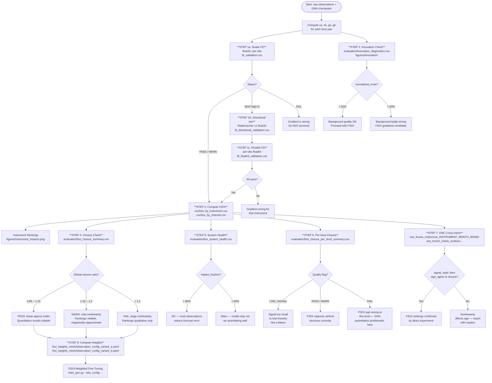

# FSOI Outputs Guide

This guide is a **reference for interpreting the files a run produces** — the output
directory layout and a column-by-column description of every CSV and plot. For what
FSOI is, how the estimator is derived and what the study found, see
[FSOI_WORK_EXPLAINED_SIMPLY.md](FSOI_WORK_EXPLAINED_SIMPLY.md).

The one convention you need while reading these files: **negative FSOI = beneficial**
(the observation reduced forecast error); positive = detrimental.

---

## Validation Flowchart



---

## Output Directory Map

```
FSOI/fsoi_outputs/
├── seasonal_inclusion_weighted_final/    ← PRIMARY: the scored seasonal evaluations
│   └── {radiosonde,aircraft,surface}_{jan,apr,jul,oct}2025/
│       ├── csv/                          ← raw FSOI numbers
│       ├── evaluation/                   ← closure, reproducibility, coverage ledger
│       ├── figures/                      ← per-run diagnostic plots
│       └── logs/                         ← config snapshot
├── seasonal_combined_maps/               ← the same evaluations, also saving 5° grids
├── ose_frozen_metric/                    ← OSE against the frozen radiosonde metric
├── ose_frozen_metric_surface/            ← OSE against the frozen surface metric
├── combined_path/                        ← per-instrument residuals along the combined path
├── path_convergence/                     ← path integration at 9 and 17 points
├── directional_coverage/                 ← directional gradient checks, per direction support
├── fd_check_skip/                        ← scalar float32 FD (radiosonde WARN, satellites SKIP)
├── fd_check_enhanced/                    ← directional + float64 FD for satellites
├── target_metric_audit_v2/               ← coverage audit that fixes the retained groups
├── sampling_rank_sensitivity/            ← rank stability under the sampling scheme
└── paper_figures_v2/                     ← manuscript and SI figures, and their source CSVs
```

---

## Step 1 — Gradient Validation (Three-Tier)

Gradient correctness is verified using three complementary tests that together cover all instrument types regardless of observation count. The tables below focus on the output columns and status flags; each subsection states why its test exists.

---

### Step 1a — Scalar FD in float32

**File:** `evaluation/fd_validation.csv`
**Directory:** `fd_check_skip/`

Perturbs a single observation by ε, reruns the model, checks whether `(e(x+ε) − e(x−ε)) / 2ε` matches the autograd gradient at that scalar location.

| Column | Simple explanation |
|---|---|
| `gradient_autograd` | Gradient from PyTorch autograd |
| `gradient_fd_central` | Gradient estimated by central difference |
| `rel_error_central` | Relative difference between the two |
| `status` | PASS / WARN / SKIP / FAIL |

| Status | Meaning | Action |
|---|---|---|
| **PASS** | Match within 1% | Proceed confidently |
| **WARN** | Match within 5% | Proceed — minor rounding |
| **SKIP** | Per-obs gradient ~10⁻⁸; ε×gradient ~10⁻¹⁰ below float32 ULP — indistinguishable from zero by design | Run Steps 1b and 1c |
| **FAIL** | Gradient is wrong | Stop |

---

### Step 1b — Directional Derivative (Rademacher, float32)

**File:** `evaluation/fd_directional_validation.csv`
**Directory:** `fd_check_enhanced/`

Instead of perturbing one scalar at a time, samples a random sign vector v ∈ {−1, +1}^(N_obs × N_ch) and tests:

```
FD estimate  : (e(x + εv) − e(x − εv)) / 2ε
Autograd est : (g · v)   where g = ∂e/∂x[instrument]
```

The expected signal is `ε × Σ|g_i|` — for ATMS (N=50k, ε=0.01) this is ~1.1×10⁻⁴ ≈ **90 float32 ULP**, clearly detectable without float64. This test is run for `n_trials` independent random vectors and reports the Pearson correlation between the FD and autograd directional derivatives.

| Column | Simple explanation |
|---|---|
| `inst_name` | Instrument tested |
| `trial` | Which random vector (0 … n_trials−1) |
| `autograd_dd` | Autograd directional derivative g·v for this trial |
| `fd_dd` | FD estimate (e(x+εv) − e(x−εv)) / 2ε |
| `rel_error` | Relative difference for this trial |
| `pearson_r` | Pearson r across all trials for this instrument |
| `l1_norm` | ‖g‖₁ — total gradient magnitude (determines detectability) |
| `n_ulp` | Expected |Δe| in float32 units of least precision |
| `status` | PASS (r ≥ 0.99) / WARN / FAIL / INSUF_SIGNAL |

| Status | Meaning |
|---|---|
| **PASS** | Pearson r ≥ 0.99 and mean rel. error < 5% — gradient direction confirmed |
| **WARN** | r ≥ 0.95 — plausible but noisy |
| **FAIL** | r < 0.95 — gradient direction inconsistent with FD |
| **INSUF_SIGNAL** | n_ulp < 2 — signal too small even with aggregation; run float64 |

---

### Step 1c — Per-obs FD in float64

**File:** `evaluation/fd_float64_validation.csv`
**Directory:** `fd_check_enhanced/`

Casts the model and all batch tensors to float64, then runs the standard per-obs central-difference FD check with ε = 10⁻⁴. Float64 ULP (~2×10⁻¹⁵ at e~10) resolves perturbations as small as 10⁻¹⁰ — six orders of magnitude below the float32 limit — enabling direct per-obs FD validation for ATMS, AVHRR, and any other high-N instrument. The model is cast back to float32 on exit.

| Column | Simple explanation |
|---|---|
| `gradient_autograd` | Gradient from autograd (computed in float64) |
| `gradient_fd_central` | Central-difference FD gradient in float64 |
| `rel_error_central` | Relative difference |
| `precision` | Always `float64` |
| `status` | PASS / WARN / FAIL |

**Config keys** to enable all three tests:

```yaml
validation:
  finite_difference_check: true          # Step 1a — scalar float32
  directional_derivative_check: true     # Step 1b — Rademacher float32
  directional_n_trials: 5
  directional_epsilon: 0.01
  float64_fd_check: true                 # Step 1c — scalar float64
  float64_num_samples: 3
  float64_epsilon: 0.0001
```

---

## Step 2 — Innovation Diagnostics

**Files:**
- `evaluation/innovation_diagnostics.csv`
- `figures/innovation/innovation_histograms.png`
- `figures/innovation/innovation_bias_timeseries.png`
- `figures/innovation/innovation_skewness_heatmap.png`
- `figures/innovation/background_quality_summary.png`

### What it is

The **innovation** is the difference between an observation and the background forecast at that location: `y − H(xb)`. It tells you how much information the observation added.

- Large innovations → background was far from truth → observations matter a lot
- Near-zero innovations → background already captured what the observation shows → observations add little

These plots check whether the background (previous forecast) is behaving sensibly before any assimilation.

### What the columns mean

| Column | Simple explanation |
|---|---|
| `innovation_mean` | Average difference between obs and background (should be near 0 — no systematic bias) |
| `innovation_std` | Spread of innovations |
| `innovation_rmse` | Root-mean-square innovation |
| `normalized_rmse` | RMSE divided by obs value range; <5% is good, >20% flags a poor background |
| `innovation_skewness` | Classical third-moment skewness; useful as an outlier/tail warning |
| `innovation_median` | Robust signed median bias of `xa - xb` |
| `innovation_iqr_scaled` | Robust spread, computed as IQR / 1.349 |
| `innovation_bowley_skewness` | Robust quartile skewness; near 0 = symmetric, larger absolute values = asymmetric IQR |

### What the plots show

**`innovation_histograms.png`** — Distribution of innovations for each instrument/channel. Healthy = roughly bell-shaped, centered near zero. Skewed or multimodal distributions flag bad background forecasts or observation bias.

**`innovation_bias_timeseries.png`** — Mean innovation over time for each instrument. Drifting away from zero = the model's background is developing a systematic error.

**`innovation_skewness_heatmap.png`** — Skewness for every (instrument, channel) combination. High skewness (> ±1) means the distribution is asymmetric — one tail dominates.

**`background_quality_summary.png`** — Summary heatmap: normalized RMSE per instrument and channel. Green = background close to observations. Red = large departure.

---

## Step 3 — FSOI Numbers (the core output)

### `csv/fsoi_by_instrument.csv`

Usually one row per (instrument, pair). Stratified runs can write one row per
(instrument, pair, target variable, pressure/level). Sum rows when checking full
closure against the scored metric; collapse/average target-variable rows only
when you intentionally want comparable instrument ranking scales.

| Column | Simple explanation |
|---|---|
| `instrument` | Observation type (radiosonde, aircraft, atms, ...) |
| `pair_idx` | Which time pair (0 = first 12-hour window, 1 = second, ...) |
| `sum_impact_scaled` | Total FSOI impact for this instrument in this pair, scaled by subsampling factor. Negative = beneficial. |
| `mean_impact` | Average FSOI per individual observation |
| `positive_frac` | Fraction of observations with detrimental impact (positive FSOI). Lower = more observations are helpful. |
| `n_observations` | How many observations contributed |
| `innovation_rms` | RMS innovation for this instrument in this pair |
| `is_subsampled` | True if the instrument was randomly subsampled (e.g., ATMS capped at 50k) |
| `sample_scale` | Multiplier applied to recover the full-population total (e.g., 2.46 for ATMS) |

### `csv/fsoi_by_channel.csv`

Same as above but split by individual channel within each instrument. Useful for diagnosing which specific microwave or infrared channel is driving the impact.

### `csv/fsoi_summary.csv`

Aggregated across all 60 pairs. One row per instrument. The numbers in the paper come from here.

### `evaluation/fsoi_evaluation_summary.csv`

High-level summary of the whole run: helpful_fraction, closure ratio, n_pairs, date range.

---

## Step 4 — Closure Check

**Files:**
- `evaluation/fsoi_closure_summary.csv`
- `evaluation/fsoi_closure_diagnostics.csv`

### What it is

FSOI is a linear approximation. The **closure ratio** tests how accurate that approximation is:

```
closure_ratio = sum(FSOI_all_instruments) / (ea − eb)
```

where `ea` = forecast error with the full analysis and `eb` = forecast error with the background only.

- **ratio ≈ 1.0** → perfect — the linear approximation captures the full observation impact
- **ratio > 1** → FSOI overpredicts the actual impact (nonlinearity is significant)
- **ratio < 1** → FSOI underpredicts

### What the columns mean

| Column | Simple explanation |
|---|---|
| `median_closure_ratio` | Typical ratio across all pairs |
| `sign_agreement_frac` | Fraction of pairs where FSOI and actual error change have the same sign |
| `quality_flag` | PASS / WARN / FAIL |
| `mean_sum_fsoi` | Average total FSOI across pairs |
| `mean_ea_minus_eb` | Average actual error reduction |

### Interpreting the closure ratio

A ratio well above 1.0 means the actual observation impact is larger than FSOI's linear estimate, caused by large (3–4σ) innovations — when the analysis departs far from the background, higher-order nonlinear terms become significant and the linear formula misses them.

**A failing closure ratio does not invalidate the rankings.** Sign agreement across pairs stays high, so rankings are qualitatively correct; magnitudes are approximate.

---

## Step 5 — System Health

**File:** `evaluation/fsoi_system_health.csv`

### What it is

A single-row overall health check of the FSOI run.

| Column | Simple explanation |
|---|---|
| `mean_helpful_fraction_of_abs_total` | Across all pairs: fraction of total absolute FSOI that is helpful (negative). Target > 80%. |
| `std_helpful_fraction_of_abs_total` | How variable is the helpful fraction across pairs? |
| `mean_beneficial_fraction_of_ea` | How large is the total helpful FSOI relative to the forecast error? |
| `n_pairs_warn` | Number of pairs that triggered a warning |
| `system_flag` | OK / WARN |

---

## Step 6 — Per-Level Closure

**Files:**
- `evaluation/fsoi_closure_per_level_summary.csv`
- `evaluation/fsoi_closure_per_level_summary.csv` (same file, different rows for each variable × pressure level)

### What it is

The global closure test above collapses everything into one number. This check repeats it at each pressure level and variable separately to find *where* in the atmosphere the linear approximation holds and where it breaks.

### Extra columns (beyond closure summary)

| Column | Simple explanation |
|---|---|
| `target_variable` | Which variable (temperature, u_wind, dewpoint_temperature, ...) |
| `p_hpa` | Pressure level in hPa (1000 = near surface, 10 = upper stratosphere) |
| `relative_signal` | How big is ea−eb relative to ea at this level? If < 0.3%, the signal is buried in noise. |
| `signal_snr` | Signal-to-noise ratio of ea−eb across pairs. If < 0.7, the test is unreliable. |
| `quality_flag` | PASS / WARN / FAIL / LOW_SIGNAL / INSUF |

### Flag meanings

| Flag | Meaning |
|---|---|
| **LOW_SIGNAL** | The observation impact at this level is < 0.3% of the forecast error — too small to test. Not a model failure. |
| **PASS** | FSOI correctly predicts the sign of the error change at this level in > 65% of pairs |
| **WARN** | Sign agreement 55–65% — marginal |
| **FAIL** | Sign agreement < 55% — FSOI gets the direction wrong here |
| **INSUF** | Too few pairs to draw conclusions |

---

## Step 7 — Beneficial Fraction

**File:** `evaluation/fsoi_beneficial_fraction.csv`

### What it is

For each pair: what fraction of the total absolute FSOI was helpful (negative), and how large was it relative to the forecast error?

| Column | Simple explanation |
|---|---|
| `helpful_fsoi` | Sum of all negative (beneficial) FSOI in this pair |
| `harmful_fsoi` | Sum of all positive (detrimental) FSOI in this pair |
| `helpful_fraction_of_abs_total` | helpful / (helpful + harmful) — how "net beneficial" is the assimilation? |
| `beneficial_fraction_of_ea` | How much of the forecast error was reduced by observations? |
| `flag` | OK / WARN |

---

## Step 8 — Regional Summary

**File:** `evaluation/fsoi_regional_summary.csv`

### What it is

FSOI broken down by geographic region: tropics (30°S–30°N), extratropics NH (30–90°N), extratropics SH (30–90°S).

| Column | Simple explanation |
|---|---|
| `region` | tropics / NH_extratropics / SH_extratropics |
| `instrument` | Observation type |
| `sum_fsoi` | Total FSOI in this region for this instrument |
| `positive_frac` | Fraction of observations detrimental in this region |
| `relative_contribution_pct` | This instrument's share of total FSOI in this region |

---

## Step 9 — Pair Summary

**File:** `evaluation/fsoi_pair_summary.csv`

One row per time pair. Shows the total FSOI per instrument per pair — the raw data behind the time series plots.

---

## Step 10 — Reproducibility Check

**File:** `evaluation/reproducibility_check.csv`

Checks that running the same pair twice gives the same FSOI. Any non-determinism (from dropout, random GPU operations) would show up here as non-zero `ea_diff` or `max_ga_diff`.

If two identical passes are not run, this file is populated with empty entries — a placeholder for future use.

---

## Plots

### Instrument-level

**`figures/instrument_impacts.png`**
Bar chart: total FSOI per instrument summed over all pairs. The main ranking figure. Negative bars = beneficial. Length = magnitude of impact.

**`figures/instrument_relative_contribution.png`**
Same as above but normalized to 100% — shows each instrument's *share* of total beneficial impact.

**`figures/positive_frac_timeseries.png`**
Line chart over time: for each instrument, what fraction of its observations were detrimental each pair. Reveals whether an instrument's benefit is consistent or variable.

**`figures/impact_timeseries.png`**
Line chart: total FSOI per instrument vs. time. Shows day-to-day variability.

**`figures/positive_negative_scatter.png`**
Scatter: helpful FSOI vs. harmful FSOI per pair. Pairs above the diagonal = net detrimental. Pairs below = net beneficial. Cluster position reveals the typical balance.

### Channel-level

**`figures/channel_heatmap.png`**
Heatmap: FSOI per (instrument, channel). Rows = instruments, columns = channels. Blue = beneficial, red = detrimental. Reveals which individual channels drive the instrument's total impact.

**`figures/satellite_channel_impacts.png`**
Bar chart restricted to satellite instruments. Shows per-channel impact for ATMS, AMSUA, AVHRR, ASCAT, SSMIS, SEVIRI.

**`figures/top_satellite_channels.png`**
Top 20 individual satellite channels ranked by absolute FSOI. Useful for deciding which channels to up-weight or down-weight.

**`figures/instrument_channel_variable_pressure_heatmap_{instrument}.png`**
One plot per instrument: FSOI broken down by (variable, pressure level). Shows the vertical profile of each instrument's contribution — where in the atmosphere it helps or hurts.

### Vertical structure

**`figures/instrument_contribution_by_pressure_heatmap.png`**
All instruments together vs. pressure level. Each row is a pressure level; each column is an instrument. Color = FSOI (blue beneficial, red detrimental).

**`figures/instrument_contribution_by_pressure_heatmap_{variable}.png`**
Same but restricted to one variable (temperature, u_wind, v_wind, dewpoint_temperature). Four separate plots.

**`figures/instrument_contribution_by_variable_pressure_heatmap.png`**
Combined view: FSOI per (variable × pressure, instrument) in one figure.

### Innovation vs. FSOI

**`figures/innovation_vs_fsoi_scatter.png`**
Scatter: innovation RMS (x-axis) vs. FSOI impact (y-axis) per (instrument, pair). Instruments with large innovations should have large impacts if the model is assimilating correctly. Outliers (large innovation, near-zero FSOI) suggest the gradient is not responding to that instrument.

---

## Maps

All maps are in `figures/maps/`. They show where on the globe each instrument's observations are located and how much impact they have there.

**`fsoi_total_map.png`**
Global map: total FSOI summed over all instruments at each grid point. Shows which geographic regions are most impacted by assimilation.

**`fsoi_absolute_map.png`**
Same as total but uses absolute value — shows where impact is large regardless of sign.

**`fsoi_relative_contribution_map.png`**
Each grid point's FSOI as a fraction of the global total. Highlights the most important geographic locations.

**`fsoi_beneficial_fraction_map.png`**
At each grid point: fraction of pairs where FSOI was negative (beneficial). Green = consistently helpful region. Red = consistently detrimental region.

**`fsoi_map_{instrument}.png`** (one per instrument)
FSOI for that instrument only. Shows the geographic distribution of its observations and their local impact. Useful for checking:
- Radiosonde: sparse land-based NH cluster
- ATMS/AMSUA: dense swath patterns
- ASCAT: ocean surface wind coverage

**`fsoi_per_variable_maps.png`**
Multi-panel: one panel per target variable. Shows where temperature, wind, and moisture assimilation has the most impact.

---

## OSE Output

**Directories:** `ose_frozen_metric/` (radiosonde metric), `ose_frozen_metric_surface/`
(surface metric). One subdirectory per run, named
`ose_<instrument>_<month>_<denial_mode>/`.

### What it is

An Observing System Experiment (OSE) is a direct test of what happens when one
instrument is denied. Instead of using the linear FSOI approximation, the denied
instrument's analysis values are actually replaced and the model rerun, so the change
in forecast error is measured rather than attributed:

```
OSE = ea(xa with the instrument denied) − ea(xa full)
```

If the instrument is detrimental (FSOI > 0), denying it should *reduce* error → OSE < 0.
If it is beneficial (FSOI < 0), denying it should *increase* error → OSE > 0.

The OSE is what the per-instrument FSOI numbers are validated against: it checks both
the sign and, through the closure ratio, the magnitude.

### Inventory

| | |
|---|---|
| Instruments | aircraft, AMSU-A, ATMS against the radiosonde metric; SEVIRI ASR against the surface metric |
| Months | January, April, July and October 2025 |
| Denial mode | `background_replacement` throughout; one `drop_nodes` and one `pathsweep` run are kept for comparison only |
| Metric | the frozen target metric, whose config digest is checked on every reuse |

Because the config digest matches the seasonal FSOI runs, J is the same quantity in
both, so the OSE closure ratios are directly comparable to the FSOI ones.

One caveat when counting cycles: AMSU-A reports nothing in `bin2025072912`, so the
control tensor cannot be built and no OSE record is written for that pair — but the
cycle ledger still marks it completed. The loss is visible only by comparing row
counts between instruments. Do not assume the intervention runs retain exactly the
FSOI cycles; check `target_metric_cycles.csv` against `ose_results.csv`.

### Files produced

| File | What it shows |
|---|---|
| `evaluation/ose_results.csv` | Per-pair OSE impact: `ea_control`, `ea_denied`, `ose_impact`, plus the matched FSOI and path-integration columns (full inventory in the appendix) |
| `evaluation/ose_vs_fsoi_comparison.csv` | Merged table: FSOI predicted vs OSE measured, closure ratio, sign agreement |
| `evaluation/target_metric_cycles.csv` | The cycle ledger — which pairs were attempted, completed or skipped |
| `ose_summary.csv` | One row per run, at the root of each OSE tree |

### Key columns in ose_vs_fsoi_comparison.csv

| Column | Simple explanation |
|---|---|
| `fsoi_predicted` | What FSOI said the instrument's impact would be |
| `ose_impact` | What actually happened when it was denied |
| `closure_ratio` | fsoi_predicted / ose_impact — close to 1 = FSOI was accurate |
| `sign_agree` | True if FSOI and OSE agree on beneficial vs detrimental |
| `matched_signal_valid` | False when the difference is below the run's signal threshold, so the ratio carries no information |

Read `closure_ratio` only where `signal_valid` is true. The per-pair rows carry the
same pair of columns under the `matched_` prefix (`matched_closure_ratio`,
`matched_signal_valid`), and the path-integration columns under `path_`.

---

## FSOI Weights

**Primary (use for training):** `FSOI/fsoi_weights_mesh/`
**Biased (do not use):** `FSOI/fsoi_weights/`

> **Provenance.** Both weight tables were computed in May 2026, before the coverage
> audit, the frozen verification metric and the first-of-month exclusion were in
> place, and their cycle counts do not match the current scored evaluations. They
> remain usable as training weights, which is a separate question from verification,
> but they are **not** the manuscript's numbers and must not be cited as such.
> Regenerate them from `seasonal_inclusion_weighted_final/` before relying on the
> magnitudes.

### Why two sets?

The obs-space weights (`fsoi_weights/`) were computed from runs that verified the forecast error only at radiosonde locations (~3,000 sites, concentrated in the northern hemisphere). This artificially inflates the radiosonde weight because the error metric literally measures how well the model forecasts at radiosonde sites.

The mesh-space weights (`fsoi_weights_mesh/`) verify against the GFS analysis at all 40,962 global mesh nodes — no geographic bias. These are used for training.

### Files

| File | What it is |
|---|---|
| `fsoi_weight_summary.csv` | Full table: instrument, n_pairs, mean_impact, positive_frac, reliability, Weight A, Weight B |
| `observation_config_variant_a.yaml` | YAML config for train_gnn.py — weights ∝ absolute mean impact |
| `observation_config_variant_b.yaml` | YAML config for train_gnn.py — weights ∝ mean impact × reliability² (penalizes inconsistent instruments) |

### Variant A vs Variant B

**Variant A** (`w ∝ |mean_impact|`): An instrument's training weight is proportional to how large its average impact is. Radiosonde dominates because it has the largest impact by far.

**Variant B** (`w ∝ |mean_impact| × reliability²`): Adds a reliability penalty. An instrument that is helpful 90% of the time gets a higher weight than one with the same mean impact but that flips between helpful and detrimental. Encourages the model to learn from consistent signals.

---

## Quick Reference: What Does Each File Answer?

| File | Question it answers |
|---|---|
| `fd_validation.csv` | Scalar float32 FD: are per-obs gradients correct? (radiosonde/aircraft) |
| `fd_directional_validation.csv` | Rademacher direction test: gradient direction correct for satellites? |
| `fd_float64_validation.csv` | Float64 per-obs FD: definitive per-obs check for ATMS/AVHRR/SSMIS |
| `innovation_diagnostics.csv` | Is the background forecast behaving reasonably? |
| `fsoi_by_instrument.csv` | What was each instrument's impact each pair? |
| `fsoi_by_channel.csv` | Which specific channels drive the impact? |
| `fsoi_summary.csv` | What is the overall ranking across all pairs? |
| `fsoi_closure_summary.csv` | How accurate is the linear FSOI approximation? |
| `fsoi_closure_per_level_summary.csv` | Where in the atmosphere does the approximation hold? |
| `fsoi_system_health.csv` | Is assimilation helping or hurting overall? |
| `fsoi_beneficial_fraction.csv` | What fraction of impact is helpful, pair by pair? |
| `fsoi_regional_summary.csv` | Which regions benefit most from observations? |
| `ose_vs_fsoi_comparison.csv` | Does removing ATMS actually do what FSOI predicted? |
| `fsoi_weight_summary.csv` | How should each instrument be weighted in fine-tuning? |

---

## Step 12 — Stratification Framework (Subtype & Pressure Level)

**Purpose:** Decompose FSOI by observation subtype (aircraft model, surface station type, pressure level) to understand population-specific contributions and detect cancellation artifacts.

**Modules:**
- `fsoi_utils.py` — Helper functions: `detect_aircraft_subtype()`, `detect_surface_subtype()`, `nearest_pressure_level()`, `build_stratification_key()`

### Why stratification matters

Instrument-level aggregation can hide important structure:

**Example: Aircraft temperature**
- Mixing AIRCAR and AIRCFT observations (different aircraft types with different preprocessing biases) into one channel leads to bimodal innovation distributions
- FSOI aggregate masks the fact that one subtype is beneficial (+) while the other is detrimental (−), causing the two to partially cancel
- Stratified FSOI reveals the true subpopulation impacts

**Example: Surface wind**
- Land stations (ADPSFC) and ship observations (SFCSHP) have different wind characteristics and assimilation behavior
- Aggregated u_wind may show weak total impact; stratified reveals one subtype is consistently beneficial and the other detrimental
- Allows targeted weight adjustments per subtype

### Available stratification dimensions

| Instrument | Dimensions | Method |
|---|---|---|
| Aircraft | AIRCAR vs AIRCFT | Inferred from station ID patterns or BUFR subset code |
| Surface obs | ADPSFC vs SFCSHP | Inferred from BUFR subset code |
| Radiosonde | Pressure level (16 standard levels: 1000–10 hPa) | Mapped via `nearest_pressure_level()` |
| Satellites | Channel only (no subtype) | Use as-is |

### Usage example

```python
from gnn_model.FSOI.fsoi_utils import build_stratification_key, detect_aircraft_subtype

# Build a stratification key for aircraft temperature from AIRCAR subset
key = build_stratification_key('aircraft', 'temperature', subtype='AIRCAR')
# Returns: 'aircraft/temperature/AIRCAR'

# Alternatively, infer from station ID:
aircraft_type = detect_aircraft_subtype(station_id_array)
# Returns: 'AIRCAR', 'AIRCFT', or None for each observation
```

### Output format

When using stratified aggregation, the output CSV includes a `stratification_key` column:

```
instrument,variable,channel,subtype,pressure_level,sum_fsoi,mean_fsoi,n_obs
aircraft,temperature,1,AIRCAR,,0.053,0.00015,350000
aircraft,temperature,1,AIRCFT,,−0.027,−0.00011,220000
surface_obs,u_wind,3,ADPSFC,,0.142,0.00089,160000
surface_obs,u_wind,3,SFCSHP,,−0.089,−0.00044,85000
radiosonde,temperature,1,,700,0.089,0.00042,210000
radiosonde,temperature,1,,500,−0.012,−0.00008,195000
```

### Integration into fsoi_inference.py

To enable automatic subtype detection during FSOI computation:

1. Extract BUFR metadata (subset code or station ID) from observations during scatter sample collection
2. Call `detect_aircraft_subtype()` or `detect_surface_subtype()` to tag each observation
3. Add `subtype` column to `scatter_samples.csv`
4. Aggregation functions use the column automatically to produce stratified outputs

---

## Step 13 — Conventional Obs Variable Naming

**Purpose:** Replace generic channel numbers (Ch1, Ch2, Ch3, Ch4, Ch5) with physically meaningful variable names (temperature, specific_humidity, u_wind, v_wind, surface_pressure) for conventional observations.

### Channel mapping

**Aircraft (BUFR AIRCAR/AIRCFT):**

| Channel | Variable | Units | Typical Range |
|---|---|---|---|
| 1 | Temperature (2 m) | K | 255–305 |
| 2 | Specific humidity | kg/kg | 0.001–0.020 |
| 3 | u-wind (10 m) | m/s | −30 to +30 |
| 4 | v-wind (10 m) | m/s | −30 to +30 |

**Surface observations (BUFR ADPSFC/SFCSHP):**

| Channel | Variable | Units | Typical Range |
|---|---|---|---|
| 1 | Temperature (2 m) | K | 255–305 |
| 2 | Specific humidity | kg/kg | 0.001–0.020 |
| 3 | u-wind (10 m) | m/s | −30 to +30 |
| 4 | v-wind (10 m) | m/s | −30 to +30 |
| 5 | Surface pressure | Pa | 95,000–105,000 |

**Radiosonde (BUFR ADPUPA/UPRAIR/PREPBUFR):**

| Channel | Variable | Units | Typical Range | Notes |
|---|---|---|---|---|
| 1 | Temperature | K | 190–310 | Depends on pressure level |
| 2 | Dewpoint temperature | K | 190–310 | Often ≤ T; indicates moisture |
| 3 | u-wind | m/s | −50 to +50 | High aloft |
| 4 | v-wind | m/s | −50 to +50 | High aloft |

### Implementation in plots

All innovation diagnostic plots now display:
- **For conventional obs (aircraft, surface, radiosonde):** Variable name (e.g., "temperature", "u_wind")
- **For satellites (ATMS, AMSUA, AVHRR, etc.):** Channel number (e.g., "Ch1", "Ch23") since satellite channels do not have standardized physical names

Example plot titles:
- ✓ `innovation_histograms_aircraft_temperature.png` (clear)
- ✓ `innovation_histograms_surface_obs_u_wind.png` (clear)
- ✓ `innovation_histograms_atms.png` (channels 1–24 labeled on plot)

### Updating existing plots

To regenerate innovation diagnostic plots with variable names:

```bash
python gnn_model/FSOI/plotting/plot_innovation_diagnostics.py \
    --scatter gnn_model/FSOI/fsoi_outputs/seasonal_inclusion_weighted_final/aircraft_apr2025/csv/scatter_samples.csv \
    --diag gnn_model/FSOI/fsoi_outputs/seasonal_inclusion_weighted_final/aircraft_apr2025/evaluation/innovation_diagnostics.csv \
    --output gnn_model/FSOI/fsoi_outputs/seasonal_inclusion_weighted_final/aircraft_apr2025/figures/innovation
```

The script now:
1. Checks if the instrument is conventional (aircraft, surface_obs, radiosonde) or satellite
2. Maps channel numbers to variable names for conventional obs
3. Uses generic "Ch{N}" labels for satellites
4. Updates all four diagnostic plots (histograms, bias timeseries, background quality, skewness) with readable labels

---

## Appendix — current column inventory

Generated from the newest run of each kind on 23 September 2026, so it reflects
what the code writes today rather than what it wrote when the prose above was
first drafted. Where the two disagree, this appendix is the accurate one. The
provenance columns repeat the frozen-metric identity on every row and exist so a
file can be audited in isolation; they are not results.

### `fsoi_by_instrument.csv`

54 columns. Sampled from `FSOI/fsoi_outputs/seasonal_combined_maps/surface_obs_oct2025/csv/fsoi_by_instrument.csv`.

```
instrument, instrument_id, n_observations, n_channels
n_valid_values, n_total_values, raw_n_observations, sampled_n_observations
sample_scale, is_subsampled, mean_impact, sum_impact
sum_impact_scaled, positive_frac, sum_impact_ht, sum_impact_scaled_uniform
population_scaling_method, estimated_valid_values_ht, population_valid_values, mean_impact_population
mean_impact_hajek, innovation_mean, innovation_std, innovation_abs_mean
innovation_rms, gradient_mean, gradient_abs_mean, gradient_rms
projection_mean, alignment_cosine, alignment_frac, target_variable
target_channel, p_idx, p_hpa, group_weight
target_metric_id, pair_idx, prev_bin, curr_bin
lead_step, ea, eb, ea_p
eb_p, ea_total, eb_total
```

Plus 7 provenance columns repeated on every row: `sampling_design`, `sampling_seed`, `target_metric_version`, `target_metric_ids`, `target_metric_config`, `target_mask_applied`, `target_loss_accumulation_dtype`.

### `fsoi_by_channel.csv`

59 columns. Sampled from `FSOI/fsoi_outputs/seasonal_combined_maps/surface_obs_oct2025/csv/fsoi_by_channel.csv`.

```
instrument, instrument_id, channel, mean_impact
sum_impact, positive_count, negative_count, zero_count
total_count, raw_total_count, positive_frac, raw_n_observations
sampled_n_observations, sample_scale, is_subsampled, sum_impact_ht
sum_impact_scaled, sum_impact_scaled_uniform, population_scaling_method, estimated_valid_values_ht
population_valid_values, mean_impact_population, mean_impact_hajek, total_count_scaled
innovation_mean, innovation_std, innovation_abs_mean, innovation_rms
gradient_mean, gradient_abs_mean, gradient_rms, projection_mean
alignment_cosine, alignment_frac, pressure_level_idx, pressure_hpa
target_variable, target_channel, p_idx, p_hpa
group_weight, target_metric_id, pair_idx, prev_bin
curr_bin, lead_step, ea, eb
ea_p, eb_p, ea_total, eb_total
```

Plus 7 provenance columns repeated on every row: `sampling_design`, `sampling_seed`, `target_metric_version`, `target_metric_ids`, `target_metric_config`, `target_mask_applied`, `target_loss_accumulation_dtype`.

### `fsoi_combined_by_instrument.csv`

47 columns. Sampled from `FSOI/fsoi_outputs/seasonal_combined_maps/surface_obs_oct2025/csv/fsoi_combined_by_instrument.csv`.

```
instrument, instrument_id, n_observations, n_channels
n_valid_values, n_total_values, raw_n_observations, sampled_n_observations
sample_scale, is_subsampled, mean_impact, sum_impact
sum_impact_scaled, positive_frac, sum_impact_ht, sum_impact_scaled_uniform
population_scaling_method, estimated_valid_values_ht, population_valid_values, mean_impact_population
mean_impact_hajek, innovation_mean, innovation_std, innovation_abs_mean
innovation_rms, gradient_mean, gradient_abs_mean, gradient_rms
projection_mean, alignment_cosine, alignment_frac, pair_idx
prev_bin, curr_bin, lead_step, ea
eb, metric_aggregation, background_endpoint, control_repeat_abs_difference
```

Plus 7 provenance columns repeated on every row: `sampling_design`, `sampling_seed`, `target_metric_version`, `target_metric_ids`, `target_metric_config`, `target_mask_applied`, `target_loss_accumulation_dtype`.

### `fsoi_combined_by_channel.csv`

52 columns. Sampled from `FSOI/fsoi_outputs/seasonal_combined_maps/surface_obs_oct2025/csv/fsoi_combined_by_channel.csv`.

```
instrument, instrument_id, channel, mean_impact
sum_impact, positive_count, negative_count, zero_count
total_count, raw_total_count, positive_frac, raw_n_observations
sampled_n_observations, sample_scale, is_subsampled, sum_impact_ht
sum_impact_scaled, sum_impact_scaled_uniform, population_scaling_method, estimated_valid_values_ht
population_valid_values, mean_impact_population, mean_impact_hajek, total_count_scaled
innovation_mean, innovation_std, innovation_abs_mean, innovation_rms
gradient_mean, gradient_abs_mean, gradient_rms, projection_mean
alignment_cosine, alignment_frac, pressure_level_idx, pressure_hpa
pair_idx, prev_bin, curr_bin, lead_step
ea, eb, metric_aggregation, background_endpoint
control_repeat_abs_difference
```

Plus 7 provenance columns repeated on every row: `sampling_design`, `sampling_seed`, `target_metric_version`, `target_metric_ids`, `target_metric_config`, `target_mask_applied`, `target_loss_accumulation_dtype`.

### `fsoi_combined_closure.csv`

12 columns. Sampled from `FSOI/fsoi_outputs/seasonal_combined_maps/surface_obs_oct2025/csv/fsoi_combined_closure.csv`.

```
pair_idx, lead_step, curr_bin, fsoi_raw_sampled
delta_j_actual, signal_threshold, control_reproducibility_error, signal_valid
threshold_basis, sign_agreement, closure_ratio, relative_absolute_closure_error
```

### `fsoi_summary.csv`

18 columns. Sampled from `FSOI/fsoi_outputs/seasonal_combined_maps/surface_obs_oct2025/csv/fsoi_summary.csv`.

```
instrument, sum_impact_mean, sum_impact_std, sum_impact_sum
mean_impact_mean, mean_impact_std, positive_frac_mean, sum_impact_scaled_mean
sum_impact_scaled_std, sum_impact_scaled_sum, raw_n_observations_sum, sample_scale_mean
innovation_abs_mean_mean, innovation_rms_mean, gradient_abs_mean_mean, gradient_rms_mean
alignment_cosine_mean, alignment_frac_mean
```

### `ose_results.csv`

75 columns. Sampled from `FSOI/fsoi_outputs/combined_path/radiosonde_jul2025/evaluation/ose_results.csv`.

```
pair_idx, prev_bin, curr_bin, lead_step
denied_instruments, ose_intervention_scope, denied_channel_indices, denied_channel_numbers
denied_channel_names, ose_denial_mode, ose_denial_description, ose_mask_fill_values
ose_mask_fill_conventions, ea_control, ea_denied, ose_impact
ose_sign, ose_relative_impact, verification_target, mesh_instrument
mesh_pressure_level_idx, ose_spatial_npz, loss_reduction, ose_input_channel_mask_synced
ose_input_channel_mask_false_counts, ose_all_missing_row_fraction, ose_max_all_missing_row_fraction, ose_dropped_rows
matched_comparison_mode, matched_sign_convention, matched_fsoi, matched_fsoi_by_instrument
delta_j_actual, j_control, j_denied, matched_control_repeated
matched_control_repeat, matched_control_reproducibility_error, matched_control_reproducibility_source, matched_closure_ratio
matched_signal_threshold, matched_signal_threshold_basis, matched_observed_control_reproducibility_error, matched_signal_valid
matched_sign_agree, matched_population_scaled, matched_sampled_rows, matched_raw_rows
matched_sample_scale, path_integration_enabled, path_integration_t_values, path_integration_rule
path_j_values, path_directional_derivatives, path_directional_derivatives_by_instrument, path_integrated_fsoi
path_closure_ratio, path_signal_valid, path_sign_agree, path_abs_error
matched_abs_error, path_abs_error_improvement, path_relative_error_reduction, path_minus_matched_fsoi
path_minus_delta_j_actual, observed_control_reproducibility_error
```

Plus 9 provenance columns repeated on every row: `target_metric_version`, `target_metric_ids`, `target_metric_config`, `target_mask_applied`, `target_loss_accumulation_dtype`, `target_instruments`, `target_variables`, `target_pressure_levels`, `use_area_weights`.

### `fd_directional_validation.csv`

19 columns. Sampled from `FSOI/fsoi_outputs/directional_coverage/surface_obs_valid_only/evaluation/fd_directional_validation.csv`.

```
pair_idx, curr_bin, inst_name, trial
autograd_dd, fd_dd, rel_error, pearson_r
l1_norm, n_ulp, status, epsilon
direction_support
```

Plus 6 provenance columns repeated on every row: `seed`, `target_metric_version`, `target_metric_ids`, `target_metric_config`, `target_mask_applied`, `target_loss_accumulation_dtype`.

### `innovation_diagnostics.csv`

15 columns. Sampled from `FSOI/fsoi_outputs/seasonal_combined_maps/surface_obs_oct2025/evaluation/innovation_diagnostics.csv`.

```
pair_idx, curr_bin, lead_step, instrument
channel, n_obs, innovation_mean, innovation_std
innovation_skewness, innovation_median, innovation_iqr_scaled, innovation_bowley_skewness
innovation_rmse, obs_range, normalized_rmse
```

### `scatter_samples.csv`

10 columns. Sampled from `FSOI/fsoi_outputs/seasonal_combined_maps/surface_obs_oct2025/csv/scatter_samples.csv`.

```
instrument, channel, innovation, fsoi
lat, lon, pair_idx, lead_step
target_variable, p_hpa
```
