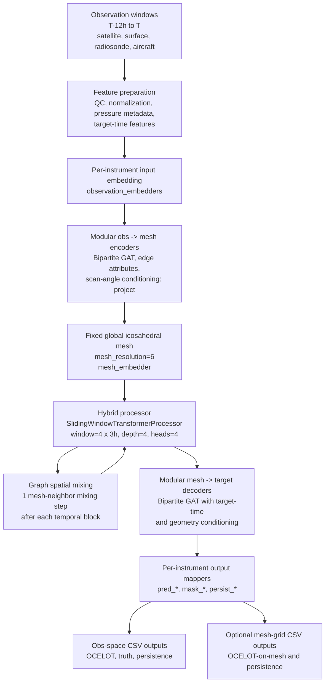

# OCELOT: A Graph-Transformer Hybrid Model for Direct Observation Prediction

Author: Azadeh Gholoubi

Version: `ocelot-v1.0`

## Overview
This project implements a Graph Neural Network (GNN) for weather prediction, inspired by DeepMind's GraphCast model. It uses a heterogeneous graph structure to integrate multiple observation types, including satellite, surface, radiosonde, and aircraft observations, on a global icosahedral mesh.

The pipeline is built with PyTorch Lightning and PyTorch Geometric and features a modular architecture that separates data processing, model definition, and training into clean, maintainable components.

This version is the source-code snapshot used as the OCELOT v1 reference for
the AIES submission.

## Key Features
**Heterogeneous Graph Structure**: The model uses `torch_geometric.HeteroData` to represent the Earth's atmosphere, with distinct node and edge types for the mesh grid and each observational instrument. This allows for flexible and powerful multi-instrument data fusion.

**Encoder-Processor-Decoder Architecture**:
- An Encoder projects raw features from each observation type onto the shared mesh.
- The OCELOT v1 Processor uses a hybrid sliding-window transformer with graph
  spatial mixing to evolve latent mesh states across rollout steps.
- An InteractionNetwork processor remains available as an alternative
  message-passing option for fixed-mesh and experimental configurations.
- A Decoder maps the processed mesh state back to the observation locations to make predictions.

**Evaluation Baselines**:
- Writes OCELOT predictions (`pred_*`), truth (`true_*`), masks (`mask_*`), and persistence baselines (`persist_*`) for obs-space outputs.
- Writes persistence baselines for mesh-grid outputs, matching by lat/lon and pressure level for radiosonde/aircraft.
- Supports OCELOT vs Truth, OCELOT vs GFS, persistence, and mesh-grid GFS analysis comparisons.

**Mesh-grid GFS Evaluation**:
- Interpolates GFS forecast fields to OCELOT mesh points (`gfs_*`).
- Optionally adds GFS f000 analysis fields (`anl_*`) at valid time.
- Produces 3-panel forecast-only plots and 6-panel forecast-plus-analysis plots.

**Scalable & Efficient Training**:

- Supports multi-node, multi-GPU distributed training using PyTorch Lightning's DDPStrategy.
- Implements gradient checkpointing to reduce memory usage, allowing for deeper models and larger batch sizes.
- Features a flexible data pipeline with random window resampling for robust, generalized training on massive time-series datasets.

## Core Scripts
- `train_gnn.py`: The main script for launching training and evaluation.
- `gnn_model.py`: Defines the GNNLightning module, which contains the complete model architecture (embedding, encoders, processor, decoders).
- `gnn_datamodule.py`: Handles all data loading, processing, and graph construction, preparing HeteroData batches for the model.
- `process_timeseries.py`: Performs the initial data extraction, time-binning, Quality Control (QC) filtering, and feature engineering.
- `callbacks.py`: Contains custom PyTorch Lightning callbacks for data resampling (ResampleDataCallback).
- `predict_gnn.py`: Runs prediction/evaluation outputs, including obs-space and optional mesh-grid CSVs.
- `evaluation/scripts/compare_mesh_to_gfs.py`: Interpolates GFS forecast and analysis fields onto OCELOT mesh points.
- `evaluation/scripts/plot_mesh_vs_gfs_maps.py`: Plots OCELOT/GFS mesh-grid comparisons.
- `configs/`: Directory for managing observation configurations, such as instrument and channel weights.
## Installation
Create an environment and install the necessary packages.
```bash
pip install -r requirements.txt

```
On Hera/NESCC-style systems, use the Conda environment used for OCELOT v1 training and validation:

```bash
source /scratch3/NCEPDEV/da/Azadeh.Gholoubi/miniconda3/etc/profile.d/conda.sh
conda activate gnn-env
```

Or a minimalist install:
```bash
pip install numpy pandas scipy torch trimesh networkx torch-geometric scikit-learn zarr joblib lightning psutil

```
## Usage 
### Configure Your Experiment
Modify `train_gnn.py` to set the hyperparameters for your run:
- Set the full date range for the experiment (FULL_START_DATE, FULL_END_DATE).
- Configure the observation_config dictionary to define which instruments and features to use.
- Adjust model hyperparameters like mesh_resolution, hidden_dim, and num_layers.

### Launch training
Use `run_gnn_Rand.sh` for the OCELOT v1 random-window training configuration.
`run_gnn.sh` and `run_gnn_Seq.sh` provide general and sequential-window Slurm
launchers.

To start a new run from `sbatch run_gnn_Rand.sh`:
```bash
srun --cpu-bind=map_cpu:0,1,2,3 python train_gnn.py
```
To resume a run from the last saved checkpoint:
 ```bash
python train_gnn.py --resume_from_checkpoint checkpoints/last.ckpt
```
Submit the Slurm script:
```bash
sbatch run_gnn_Rand.sh
```

### Evaluation

See [`evaluation/README_EVALUATION.md`](evaluation/README_EVALUATION.md) for pointwise OCELOT and persistence metrics, obs-space OCELOT/GFS comparisons, mesh-grid OCELOT/GFS/analysis comparisons, and 2025/seasonal evaluation workflows.
### Debug & plots (optional)
Pass the `--verbose` flag to `train_gnn.py`:
```bash
sbatch run_gnn.sh --verbose
```
### Model Architecture
The OCELOT v1 training configuration in `run_gnn_Rand.sh` uses a fixed global
icosahedral mesh, modular observation encoders and target decoders, and a
hybrid temporal-spatial processor. Input observations from the previous 12 hours
are encoded onto the mesh, evolved with a sliding-window transformer plus graph
spatial mixing, and decoded to the target observation locations and optional
mesh-grid outputs.



The InteractionNetwork processor remains available as an alternative
message-passing option, but it is not the processor used by the OCELOT v1
random-window training script.
